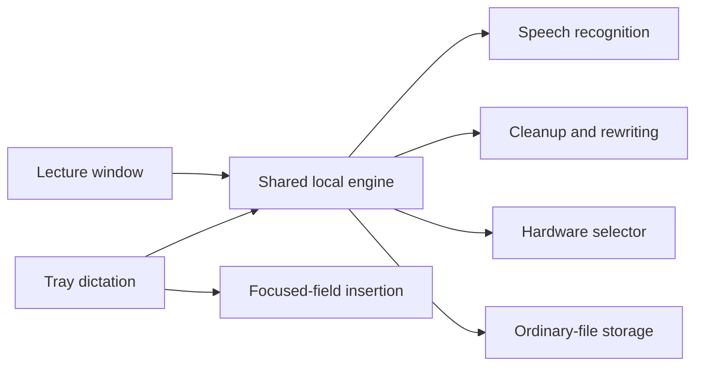

# Audio Transcriber — Product Requirements Document

**Version:** 1.1  
**Date:** 2026-08-20  
**Status:** Build-ready specification  
**Product type:** Personal-first, local Windows desktop application  
**Package name:** `audio-transcriber`
**Document status:** Historical planning requirements; current implemented scope is in the README
**License:** MIT for original application code; model and dataset licenses remain separate

> Historical planning document: the implemented standalone transcription engine
> and desktop workflow are described in the README and user guide. File cleanup
> is experimental; live microphone dictation, hotkeys, and insertion remain planned.

## 1. Executive summary

Audio Transcriber is an English-only Windows desktop application for two related workflows:

1. **Live dictation:** capture speech, remove fillers and false starts, optionally rewrite it, and insert the final text into ordinary editable desktop fields.
2. **Lecture transcription:** record a microphone or import an audio/video file, create a timestamped transcript, retain the source audio and transcript versions, and provide local review, search, playback, cleanup, outline, summary, and export tools.

The product runs locally without paid APIs. It uses OpenVINO-compatible speech and language models and benchmarks the available CPU, Intel GPU, and Intel NPU instead of assuming which device is fastest. It must make NPU use inspectable and verifiable. Hardware-specific branding is pending replacement; CPU, GPU, and NPU are execution options.

The first supported and optimized machine is the owner's Windows 11 laptop: Intel Core Ultra 5 335, Intel NPU, Intel integrated graphics, and 32 GB RAM. The application should have a best-effort CPU fallback for development, CI, and reviewers, but broad hardware support is not a v1 release gate.

The software is intended to replace the owner's need for a paid dictation product—not to reproduce every feature or polish level of commercial software. The release succeeds if it is reliable enough for the owner's routine dictation and lecture workflow and if its eventual public repository honestly demonstrates Windows integration, local AI inference, hardware benchmarking, testing, and architectural judgment. Initial development and local Git history do not depend on creating or publishing a GitHub repository.

## 2. Product principles

- **Local after setup:** after models are downloaded, normal use makes no network connections.
- **Raw speech remains recoverable:** cleanup and rewriting never overwrite the raw transcript.
- **Measured hardware selection:** choose devices using observed performance and compatibility, not branding or assumptions.
- **Verifiable NPU claims:** diagnostics must show whether a model was actually compiled for and executed on the NPU.
- **Reliable core before broad integration:** build and evaluate file transcription first, then lecture mode, then live dictation and app insertion.
- **Personal-first scope:** optimize for one known Windows machine and three named desktop applications.
- **Honest portfolio evidence:** document what was built, tested, and measured; do not imply model training or tests that did not occur.
- **Ordinary files:** user data is readable and portable without a proprietary database export.
- **Safe failure:** preserve recordings and text when processing, insertion, or the UI fails.

## 3. Target user and environment

### Primary user

A single owner who:

- uses Windows 11;
- dictates into ordinary desktop text fields;
- wants filler removal and optional rewriting;
- records or imports lectures up to two hours;
- accepts a one-time model download and benchmarking process;
- does not want recurring fees or API usage;
- is willing to run a guided Windows validation package during development but should not need to debug the application;
- will manually review changes and perform Git commits, pushes, and pull requests from trusted WSL.

### Target machine

- Lenovo model `21V7CTO1WW`
- Windows 11 Home, x64
- Intel Core Ultra 5 335
- 32 GB RAM
- Intel integrated GPU
- Intel NPU with an installed Intel NPU driver
- Approximately 10 GB may be used for models and caches

These details are the initial target, not a promise of universal compatibility. Runtime detection must report actual devices and drivers rather than relying on this specification.

## 4. Goals and success criteria

### Product goals

1. Produce accurate English transcripts locally from imported files and microphone recordings.
2. Make balanced dictation noticeably cleaner than literal transcription while preserving the speaker's meaning.
3. Insert short dictated text reliably into ordinary desktop applications without silently losing clipboard contents or text.
4. Use the fastest compatible local device for each workload and expose auditable device information.
5. Preserve a recoverable chain from audio to raw transcript to cleaned or rewritten result.
6. Provide a public, reproducible, well-documented portfolio repository.

### Quantitative release targets

Targets are measured on the owner's target machine unless otherwise specified. Results must be reported even when a target is missed; no target may be converted into an unverified claim.

| Area | Release target |
|---|---|
| Short dictation latency | For 15–30 second utterances, median stop-to-insert at or below 2 seconds and p95 at or below 4 seconds in Balanced mode |
| Dictation reliability | At least 98% successful insertions across a documented test matrix covering ordinary editable desktop fields |
| Clipboard safety | Original clipboard restored after successful insertion; recoverable fallback offered if insertion fails |
| Endurance | Complete a two-hour synthetic or licensed-audio transcription run without unbounded memory growth or loss of the recoverable source/transcript checkpoints |
| Offline behavior | Zero application network connections during ordinary use after models are installed |
| Hardware transparency | Every inference run records requested device, actual selected device, model, timing, and fallback reason when applicable |
| Data integrity | Raw transcript and original lecture audio are never overwritten by cleanup, rewriting, or manual edits |
| Evaluation | Publish WER/CER, latency/RTF, cleanup, semantic-preservation, and backend benchmark results with dataset and method details |

### Qualitative success conditions

- The owner can routinely dictate cleaned prose without subscribing to a paid dictation service.
- Filler removal, repetition removal, and self-correction resolution work without frequent meaning changes.
- Lecture review makes uncertain passages easy to locate by timestamp.
- The repository can be explained from documentation that points to real files, functions, commands, tests, and measured results.

## 5. Non-goals for v1

- Cloud APIs, API keys, or use of an OpenAI API subscription
- Mobile, macOS, Linux desktop, or web applications
- Universal insertion into every Windows control
- Reading surrounding text from the active application
- Selection-based rewriting of existing text
- System-audio or meeting-call capture
- Speaker diarization
- Multilingual transcription
- Model training or fine-tuning
- Real-time collaboration or cloud sync
- Automatic updater
- DOCX export
- Flashcards, quizzes, or generated study materials
- Waveform editing or a full audio editor
- Guaranteed support for elevated applications, password fields, secure fields, terminals, remote sessions, or unusual custom controls

## 6. User-visible product structure

Audio Transcriber is one installed product with shared settings, models, dictionaries, history, and inference services.



The application has:

- a background tray component for dictation, status, shortcut controls, and quick history;
- a main desktop window for lectures, settings, model management, diagnostics, history, and exports;
- a shared local engine for audio capture, transcription, text processing, storage, and hardware selection.

## 7. Functional requirements

### 7.1 First-run setup

The first-run experience must:

1. Explain that models run locally and may use approximately 10 GB.
2. Let the user choose the application-data location.
3. Default to a dedicated `Audio Transcriber` folder on the Desktop when that Desktop is local.
4. Detect likely OneDrive Desktop redirection. If detected, warn that recordings and transcripts could sync and offer a clearly labeled non-synced local location. Never silently place private recordings in a synced folder.
5. Download required models with visible progress, resumability, checksums where available, and attributable license information.
6. Detect CPU, GPU, and NPU availability through the actual inference runtime.
7. Benchmark compatible devices on identical representative inputs for speech recognition and rewriting separately.
8. Select defaults from measured results while allowing later overrides.
9. Configure global shortcuts and launch-at-sign-in. Launch-at-sign-in is enabled by default but can be disabled.
10. Provide a microphone test and clearly show where test audio is stored or when it is discarded.

The process may take 10–20 minutes. An interrupted setup must resume without redownloading valid completed artifacts.

### 7.2 Hardware and model selection

The application must expose these hardware policies:

- **Fastest:** use the fastest compatible measured device for each workload.
- **Efficient:** prefer the NPU when it satisfies the configured latency/quality threshold.
- **Manual:** let the user explicitly select CPU, GPU, or NPU per workload.

Requirements:

- Use OpenVINO or a compatible Intel-supported runtime that exposes actual device selection.
- Compile models explicitly for the requested device when supported.
- Verify the resulting compiled device and record any fallback.
- Never label a run “NPU” solely because an NPU exists on the machine.
- Benchmark CPU, GPU, and NPU using the same model, input, warmup method, and repetition policy when a fair comparison is technically possible.
- Report model-load time, first-run latency, steady-state latency, real-time factor, and peak memory where measurable.
- Choose the most accurate speech model that still satisfies dictation latency and lecture throughput constraints.
- Allow speech recognition and text rewriting to use different devices.
- Provide a diagnostics screen and exportable redacted diagnostic report.
- Allow models and caches to be viewed and removed.

If a selected device is unavailable, the application may fall back only when the user policy permits it. The UI and logs must state the fallback and reason.

### 7.3 Dictation

#### Capture and controls

- Provide configurable global shortcuts for both:
  - hold-to-talk;
  - press-once to start and press-again to stop.
- Provide three configurable mode shortcuts:
  - **Balanced** — default;
  - **Raw**;
  - **Aggressive**.
- The tray menu can change the default mode.
- Show an unambiguous visual recording state and processing state.
- Provide configurable audible start and stop cues.
- Do not record when the user has not explicitly activated dictation.

#### Processing modes

**Raw** preserves the spoken wording while adding automatic punctuation and capitalization.

**Balanced** must:

- remove ordinary fillers;
- collapse accidental repetitions;
- resolve false starts and explicit self-corrections such as “actually,” “I mean,” and “scratch that”;
- fix obvious grammar and punctuation;
- apply light structural cleanup;
- preserve claims, numbers, names, qualifiers, intent, and tone;
- avoid adding facts or arguments.

**Aggressive** may rewrite for clarity and concision, but must still preserve meaning and may not invent content. Its result receives a preview when configured or when the input exceeds the automatic-insertion threshold.

**Current batch implementation:** Balanced remains a conservative rule layer.
Local model cleanup is an explicit separate AI layer with lecture/dictation modes
and Off/Light/Medium controls. Selected cleanup follows desktop transcription
automatically; CLI can opt in. Summary saves separate formatted excerpt notes.
Cleanup reads Raw, keeps completed revision snapshots, records
source/model provenance, and falls back to source blocks on concrete heuristic
warnings. The light/medium choices serve the minimal-edit/clarity use cases above;
live capture, mode shortcuts, preview/insertion, and full semantic-preservation
validation remain separate release targets. See the user guide for actual controls.

Cleanup should use deterministic transformations where they are safer and sufficient. A local language model may handle semantic rewriting. Raw, cleaned, and rewritten layers must remain distinguishable.

#### Spoken formatting commands

Support a small documented command set, including at minimum:

- new paragraph;
- bullet point;
- comma;
- period;
- question mark;
- open quote;
- close quote.

Literal-escape behavior must be documented so the user can dictate the words themselves.

#### Insertion

- Automatically insert finalized text into the field that was focused when dictation began or ended, using a documented and tested focus policy.
- Test insertion into ordinary editable desktop fields.
- Up to approximately two minutes of speech may auto-insert. Longer dictation requires preview and confirmation.
- Restore the user's prior clipboard after insertion whenever the insertion mechanism temporarily uses it.
- If direct insertion fails, keep the result in local history, place it in a clearly identified fallback view, and offer an explicit copy action.
- Never discard a transcription because the target control rejected insertion.
- Provide a brief undo/retry notification after insertion.
- Detect and decline known unsafe targets such as password fields when possible.
- Do not attempt to bypass Windows privilege boundaries to inject text into elevated applications.

“Works in any box” is explicitly not a v1 promise. Windows applications use different UI frameworks, browser shells, focus models, privilege levels, and input-handling behavior. The acceptance matrix is limited to ordinary editable fields in the three named applications.

#### Uncertainty and history

- When uncertainty is moderate, insert the best result and flag the affected dictation in local history rather than interrupting every use with a confirmation.
- Store raw and processed text in local history.
- Discard successful short-dictation audio after processing by default.
- Temporarily retain failed dictation audio for diagnostics, clearly label it, and provide deletion controls.
- Allow history to be disabled and cleared.
- Provide a one-click “replace this with…” correction flow from history that can add an explicit dictionary mapping.
- Do not monitor later edits in other applications.

### 7.4 Personal dictionary

- Support manual entries for names, technical terms, acronyms, and replacement mappings.
- Store the dictionary in an ordinary, documented local format.
- Apply dictionary entries predictably and record whether a replacement was dictionary-driven.
- Provide import/export and duplicate/conflict handling.
- Do not learn silently from unrelated application contents.

### 7.5 Lecture recording and import

- Record from a selected microphone.
- Import common audio and video formats through a bundled or documented media-decoding path.
- Do not capture system audio in v1.
- Support and test continuous recordings up to two hours.
- Warn near the tested duration; do not abruptly terminate solely because two hours has elapsed.
- Write crash-safe audio and transcript checkpoints incrementally.
- Avoid memory usage that grows with the entire unprocessed recording when streaming or chunking can bound it.
- If performance permits, display provisional live text during recording.
- After recording stops, run the configured higher-accuracy final transcription and conservative cleanup pass.
- Make provisional status visually distinct from final text.

### 7.6 Lecture transcript and review

For every lecture session, retain:

1. original imported or recorded audio;
2. immutable raw timestamped transcript;
3. conservatively cleaned timestamped transcript;
4. optional editable user version;
5. optional generated outline;
6. optional generated summary;
7. session metadata and processing diagnostics.

Requirements:

- Provide one timestamped transcript; speaker diarization is deferred.
- Flag uncertain segments and link them to playback positions.
- Include a basic integrated audio player.
- Clicking a timestamp seeks the player.
- Provide transcript search.
- Manual edits never alter the raw transcript.
- Generate the outline and summary only on user request.
- Generated material must be traceable to the transcript and must not be presented as source text.
- Keep all lecture audio and transcript versions until explicit deletion.
- Show per-session and total storage usage.

### 7.7 Export

Support:

- Markdown;
- plain text;
- SRT subtitles;
- structured JSON session export;
- clipboard copy.

The JSON format must be versioned and include timestamps, transcript layers, uncertainty markers, model/device provenance, and session metadata. Exports must clearly identify raw versus processed text.

### 7.8 Settings and diagnostics

Settings must include:

- shortcuts;
- dictation mode and preview behavior;
- audio cues;
- microphone;
- data directory;
- retention/history controls;
- hardware policy and per-workload overrides;
- model management;
- launch at sign-in;
- diagnostic logging level.

Diagnostics must show:

- application version;
- OS and architecture;
- available inference devices;
- relevant driver/runtime versions when retrievable;
- model identities and versions;
- requested and actual device per workload;
- fallback reasons;
- recent performance metrics;
- storage locations and use;
- network-offline status or unexpected network attempt detection where feasible.

The application must create a user-reviewed, redacted support bundle. It must exclude transcript text, audio, usernames, absolute personal paths, clipboard contents, tokens, credentials, and unrelated system data by default.

## 8. Data and storage

### 8.1 Storage model

Use ordinary documented files in a dedicated application-data directory separate from the source repository. An illustrative structure is:

```text
Audio Transcriber/
├── config/
├── dictionary/
├── history/
├── lectures/<session-id>/
│   ├── session.json
│   ├── source-audio.<ext>
│   ├── raw-transcript.json
│   ├── cleaned-transcript.json
│   ├── edited-transcript.md
│   ├── outline.md
│   └── summary.md
├── models/
├── cache/
├── diagnostics/
└── failed-dictation-audio/
```

The implementation may refine names and formats, but the separation and portability requirements remain.

### 8.2 Integrity requirements

- Use atomic writes or write-then-rename for metadata and transcript checkpoints.
- Never overwrite the sole copy of original audio or raw transcript.
- Version schemas and provide migrations or explicit incompatibility handling.
- Detect incomplete sessions after a crash and offer recovery.
- Deletion must identify exactly what will be removed.
- No app-level encryption is required in v1; the privacy UI must state that ordinary local files are readable by the Windows account and any sync/backup software with access.

### 8.3 Repository exclusions

The public repository must exclude:

- recordings;
- transcripts and histories;
- downloaded models and caches;
- diagnostic bundles;
- machine-specific paths;
- credentials and secrets;
- proprietary or unredistributable test media.

Provide a defensive `.gitignore`, synthetic fixtures, and a pre-publication scan/checklist.

## 9. Architecture requirements

The implementing agent must perform a documented architecture spike before committing to a stack. The language is not prescribed. The chosen architecture must make the following boundaries explicit:

- audio capture and decoding;
- speech recognition;
- deterministic cleanup;
- local semantic rewriting;
- device discovery, benchmarking, selection, and provenance;
- storage and migrations;
- lecture session orchestration;
- dictation lifecycle and focus tracking;
- Windows insertion adapters;
- desktop/tray UI;
- installer and startup registration.

Python with OpenVINO is a plausible inference layer, but packaging and reliable Windows integration may justify a mixed architecture or another host language. The decision record must compare realistic alternatives using:

- NPU/runtime compatibility;
- Windows audio, tray, shortcut, focus, and insertion support;
- installer complexity;
- process isolation and crash recovery;
- testability in Linux/CI and Windows;
- maintainability by one owner;
- clarity for a portfolio reviewer.

Core transcription, cleanup, storage, and orchestration logic should not depend directly on UI controls. Device and insertion behavior must be abstracted so CPU/mock implementations can run in CI.

## 10. Privacy, security, and network requirements

- No cloud speech, language-model, telemetry, analytics, crash-reporting, or update services.
- No API keys or credentials are required.
- Model acquisition is an explicit setup/update action.
- After model acquisition, ordinary application use must function with the network disabled.
- Do not automatically check for updates.
- Updates are manual through GitHub Releases.
- Display a clear microphone-active indicator.
- Do not perform hidden or ambient recording.
- Treat imported media, model files, dataset archives, transcripts, and configuration files as untrusted input.
- Validate file types and paths; avoid command construction from user-controlled text.
- Avoid loading models or plugins that execute arbitrary repository code unless the trust and pinning decision is documented.
- Do not capture surrounding text, clipboard contents beyond the minimum insertion transaction, or content from other applications.
- Restore or preserve the clipboard even when insertion errors occur.
- Logs must minimize dictated content and personal paths.
- Dependencies and redistributed binaries require pinned versions, provenance, licenses, and integrity checks where possible.

## 11. Portable development and distribution

The application must install from the repository or a built package without
requiring the original developer's directories, accounts, or development tools.
Use a normal Python environment; see [Development](../DEVELOPMENT.md) for the
current commands. No assistant, extension, subscription, API key, or coding
service is required to run the application.

Keep source code, tests, packaging, and user documentation in the repository.
Keep recordings, transcripts, models, environments, build output, credentials,
and private machine settings outside published source packages. Automated tests
use synthetic or documented public inputs; keep private recordings local.

Use the command-line interface and standard transcript exports as the public
boundary for other applications. Integrations with particular assistants or
editors belong outside the core project. Model downloads are explicit; ordinary
transcription runs locally with the installed model and runtime.

Build and test an installed package from a different working directory before
claiming portability. Record the OS and hardware actually tested. GPU/NPU support
is optional and requires compatible hardware and drivers; one machine's results
do not establish universal compatibility.

## 12. Testing and evaluation

### 12.1 Evaluation data

The agent may autonomously acquire and document public licensed data, including:

- LibriSpeech for English read speech;
- AMI Meeting Corpus for meeting/lecture-like speech;
- Common Voice where access and current licensing/distribution permit;
- synthetic audio and transcript pairs created for punctuation, fillers, corrections, numbers, acronyms, and technical vocabulary.

Keep development and holdout cases separate. Do not tune rules or prompts directly against every reported case.

### 12.2 Metrics

Measure and report:

- word error rate (WER);
- character error rate (CER);
- timestamp alignment error or a clearly defined timestamp proxy;
- real-time factor (RTF);
- stop-to-result and stop-to-insert latency;
- model loading and warmup time;
- peak memory where supported;
- CPU/GPU/NPU device comparison;
- insertion success rate by target application and control type;
- filler-removal precision/recall on annotated synthetic and public samples;
- self-correction resolution accuracy;
- semantic preservation and content-change failures;
- hallucination or unsupported-content rate;
- crash recovery and checkpoint integrity.

Semantic-cleanup evaluation must include high-risk cases: negation, dates, quantities, technical terms, quoted speech, uncertainty, and corrections that reverse earlier wording.

### 12.3 Test layers

1. **Unit tests:** parsing, text spans, cleanup rules, dictionary, storage, schema migrations, device policy, export, path safety.
2. **Golden tests:** raw-to-cleaned transformations and spoken formatting commands.
3. **Property/fuzz tests:** malformed media metadata, transcript JSON, configuration, paths, and crash/interruption points where useful.
4. **Integration tests:** decoding, chunking, model invocation, checkpoints, exports, history, and fallback behavior.
5. **Endurance test:** two-hour synthetic or licensed input with bounded-memory assertions and recoverability checks.
6. **Offline/network test:** confirm normal use succeeds without network and detect accidental telemetry/update calls.
7. **Windows validation:** actual device, microphone, tray, installer, startup, shortcuts, and app insertion.
8. **Regression benchmark:** pinned inputs, models, runtime versions, and comparison thresholds.

Hardware-independent components must run in CI using CPU or mocks. CI must not imply NPU or Windows integration coverage that it does not execute.

### 12.4 Windows validation harness

Provide a one-command PowerShell entry point and a guided report flow that:

1. detects Windows, Intel NPU, graphics device, drivers, and OpenVINO-visible devices;
2. installs or stages the application in a reversible test location;
3. verifies model acquisition and loading;
4. benchmarks identical inputs on CPU, GPU, and NPU when supported;
5. records requested versus actual runtime device and fallback details;
6. exercises transcription and rewriting smoke tests;
7. checks installer, Start menu, tray behavior, startup registration, and data-directory rules;
8. guides the owner through microphone recording;
9. guides insertion checks in ordinary editable desktop fields;
10. restores settings and clipboard state where applicable;
11. produces both human-readable and machine-readable sanitized reports;
12. clearly labels skipped, failed, and unverified checks.

Each major host-validation round should take approximately 15–30 minutes. Plan for two or three rounds. The owner supplies outputs; the agent analyzes failures and prepares the next bounded iteration. The owner is not expected to diagnose code.

## 13. Installer and release requirements

- Produce a Windows installer appropriate to the selected stack.
- Add a Start menu entry.
- Install the tray component and main application together.
- Offer launch at sign-in, enabled by default and reversible.
- Do not require administrator rights unless the architecture spike proves they are necessary; document the reason if they are.
- Clean uninstall removes program files and startup integration while asking before deleting user recordings, transcripts, dictionaries, or models.
- Pin and record build dependencies.
- Provide reproducible build instructions.
- Generate checksums for release artifacts.
- No automatic updater; document manual GitHub Release installation.
- Release notes must distinguish verified Windows/NPU results from CI-only results.

## 14. Documentation and portfolio deliverables

Required repository documents:

- `README.md` — problem, workflows, screenshots/demo, installation, current limitations, evidence-backed results;
- `ARCHITECTURE.md` — components, processes, interfaces, dependencies, and rationale;
- `DATA_FLOW.md` — audio/text lifecycle, persistence, privacy boundaries, and failure recovery;
- `CODEBASE_GUIDE.md` — map features to actual directories, files, classes, and functions;
- `DEVELOPMENT.md` — environment setup, build, formatting, and contribution workflow;
- `TESTING.md` — exact commands, test layers, platform coverage, and untested areas;
- `MODEL_EVALUATION.md` — datasets, licenses, methodology, metrics, hardware, and results;
- `PRIVACY.md` — data handling, retention, network behavior, and limitations;
- `DECISIONS.md` — architecture decision records or index to them;
- `LICENSE` — MIT for original code;
- third-party notices and model/dataset license documentation.

Documentation must reference real code and verified commands. It must not contain generic claims copied from the PRD after the implementation differs.

Portfolio language may accurately state that the owner developed Audio Transcriber using the chosen language, OpenVINO, and local models once the owner can explain and modify the implementation. It must not claim that the owner trained Whisper, invented the underlying models, or personally hand-authored every line. Benchmark and compatibility claims must name their tested environment.

## 15. Milestones and gates

### Milestone 0 — Feasibility and architecture spike

Deliver:

- stack comparison and decision record;
- minimal model loading/transcription proof on CPU in the sandbox;
- OpenVINO NPU path designed from primary documentation but labeled host-unverified until tested;
- storage schema and process-boundary design;
- risk register;
- implementation plan mapped to requirements.

Gate: the selected stack has a credible Windows packaging, audio, tray, global-shortcut, insertion, and OpenVINO path.

### Milestone 1 — Batch transcription and evaluation core

Deliver:

- deterministic CLI or test harness for file transcription;
- decoding, chunking, timestamps, checkpoints, raw transcript storage, and export;
- public/synthetic evaluation corpus setup;
- WER/CER/RTF measurement;
- CPU/mocked CI.

Gate: repeatable transcripts and metrics from pinned public/synthetic fixtures.

### Milestone 2 — Cleanup, rewriting, and dictionary

Deliver:

- Raw, Balanced, and Aggressive pipelines;
- filler, repetition, correction, formatting-command, and dictionary handling;
- local semantic rewriting path;
- raw/clean/rewrite provenance;
- cleanup and semantic-preservation evaluation.

Gate: holdout results and failure analysis are published; raw text remains recoverable.

### Milestone 3 — Lecture mode

Deliver:

- recording and file import;
- crash-safe session persistence;
- provisional/final transcript behavior;
- player, search, timestamps, uncertainty review;
- outline, summary, and required exports;
- two-hour endurance test.

Gate: a recoverable two-hour test session completes and all transcript layers export correctly.

### Milestone 4 — Dictation mode

Deliver:

- tray component;
- global hold/toggle shortcuts and three modes;
- microphone capture and state indicators;
- preview/history/dictionary correction flow;
- clipboard-safe insertion adapters and fallback.

Gate: sandbox-testable logic passes and the Windows validation package is ready.

### Milestone 5 — Windows/NPU validation and installer

Deliver:

- one-command Windows validation harness;
- reversible installer/startup integration;
- owner-run results for NPU, microphone, desktop text fields, and latency;
- fixes from two or three bounded validation rounds;
- sanitized benchmark report.

Gate: release targets are either met or documented as known limitations with exact evidence. Actual NPU execution is verified before any NPU performance claim.

### Milestone 6 — Portfolio release package

Deliver:

- complete documentation set;
- screenshots or a demo using non-private content;
- license and third-party notices;
- clean public-repository scan;
- reproducible build and release instructions;
- PR-ready outbox package for manual owner promotion.

Gate: repository claims match test evidence and no private/model/cache artifacts are included.

## 16. Acceptance checklist

The product is v1-complete only when all applicable items are satisfied or explicitly recorded as accepted limitations:

- [ ] Installs and launches on the target Windows machine.
- [ ] Creates Start menu and tray integration.
- [ ] Launch-at-sign-in can be enabled and disabled.
- [ ] Detects actual OpenVINO CPU/GPU/NPU devices.
- [ ] Runs and records comparable device benchmarks.
- [ ] Verifies actual device selection and reports fallbacks.
- [ ] Works offline after model acquisition.
- [ ] Imports audio/video and records microphone lectures.
- [ ] Preserves source audio and immutable raw timestamped transcript.
- [ ] Provides cleaned and editable transcript layers.
- [ ] Provides player, search, clickable timestamps, and uncertainty flags.
- [ ] Generates outline and summary on demand.
- [ ] Exports Markdown, text, SRT, JSON, and clipboard content.
- [ ] Completes the two-hour endurance and recovery test.
- [ ] Supports hold-to-talk and toggle dictation.
- [ ] Supports Raw, Balanced, and Aggressive modes.
- [ ] Supports the documented spoken formatting commands.
- [ ] Inserts into ordinary ordinary desktop applications fields with clipboard restoration and failure fallback.
- [ ] Meets or transparently reports dictation latency and insertion targets.
- [ ] Stores data in the selected dedicated folder and handles OneDrive Desktop redirection explicitly.
- [ ] Provides history, retention, deletion, model, cache, and diagnostic controls.
- [ ] Contains no telemetry, cloud inference, API dependency, or automatic updater.
- [ ] Passes unit, integration, golden, endurance, privacy/network, and applicable Windows tests.
- [ ] Includes all required documentation and license notices.
- [ ] Contains no private data, downloaded models, caches, or machine-specific paths in the public package.
- [ ] Publishes a test/benchmark matrix that distinguishes CI, sandbox, and owner-run Windows results.

## 17. Risks and unresolved technical decisions

These are implementation questions for Milestone 0, not reasons to omit requirements:

1. **Host/UI stack:** choose between a Python-centric application, a native Windows host with a Python inference service, or another maintainable arrangement.
2. **Local rewrite model:** select a model and runtime that preserve meaning while satisfying latency and model-size limits. Determine whether the NPU path is compatible and actually faster.
3. **Whisper variant and quantization:** balance accuracy, latency, memory, and NPU support using measurements.
4. **Insertion mechanism:** compare Windows UI Automation, clipboard/paste, and input simulation per target application. A layered adapter with safe fallback is likely required.
5. **Focus ownership:** define how the original target is tracked across recording/processing without inserting into the wrong window.
6. **Timestamp fidelity:** determine chunking/overlap and alignment strategy for long recordings.
7. **Video decoding distribution:** evaluate FFmpeg or an alternative, including redistribution and license obligations.
8. **Installer format:** choose based on runtime bundling, per-user install, startup registration, upgrade/uninstall behavior, and reproducibility.
9. **NPU validation:** the development container cannot access the Windows NPU; all claims depend on owner-run host evidence.
10. **Two-second target:** the local rewrite model may dominate latency. If it cannot meet the target, evaluate smaller models, deterministic-first cleanup, streaming, or a clearly documented mode tradeoff.

## 18. Source and licensing baseline

Implementation should prefer primary documentation and record exact versions. Starting references:

- [Intel Core Ultra 5 335 specifications](https://www.intel.com/content/www/us/en/products/sku/245727/intel-core-ultra-5-processor-335-12m-cache-up-to-4-60-ghz/specifications.html)
- [OpenVINO GenAI inference on NPU](https://docs.openvino.ai/2025/openvino-workflow-generative/inference-with-genai/inference-with-genai-on-npu.html)
- [OpenVINO GenAI Whisper examples](https://docs.openvino.ai/2026/openvino-workflow-generative/inference-with-genai.html)
- [LibriSpeech corpus](https://www.openslr.org/12)
- [AMI Meeting Corpus](https://groups.inf.ed.ac.uk/ami/corpus/)
- [AMI Corpus license](https://groups.inf.ed.ac.uk/ami/corpus/license.shtml)
- [Mozilla Common Voice terms](https://commonvoice.mozilla.org/terms)

Model weights, runtime components, media tools, and datasets must be reviewed individually. The repository's MIT license applies only to original project code and does not relicense third-party artifacts.

## 19. Definition of done

Audio Transcriber is done for v1 when the acceptance checklist is resolved, the owner-run Windows validation evidence is incorporated, the installer and documentation are complete, the offline and data-integrity requirements hold, and the outbox contains a PR-ready public package. The autonomous agent may finish every sandbox-capable item independently, but it must label the project **host validation pending** until the owner has run and returned the required Windows checks. Git commits, pushes, pull requests, and releases remain manual trusted-host actions.
